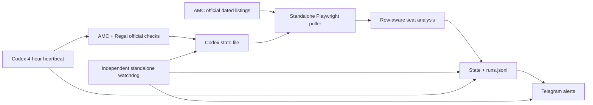

# The Odyssey IMAX 70mm Monitor

Read-only monitoring for *The Odyssey* in **IMAX 70mm only** at:

- AMC Metreon 16, San Francisco
- Regal Hacienda Crossings, Dublin, California

The system watches for new bookable dates, showtime changes, usable-seat scarcity, monitor failures, and evidence that the run may be ending. It never selects seats, holds tickets, enters checkout, creates an account, or purchases anything.

## Status

The implementation is complete, tested, and active. Both standalone `launchd` jobs are installed for the local user. The Codex heartbeat runs every four hours and uses the same acceptable-seat policy. Run `npm run status` from this directory for a one-command health summary.

Telegram support is active and reads the existing private `.env`. Ticket messages require at least one acceptable seat. Failure alerts and the daily `HEALTH OK` are exempt from that gate because otherwise the monitor could fail silently when no good seats are available.

The party size is configured for a single ticket:

```json
"partySize": 1
```

With a party of one, any acceptable seat satisfies the party requirement, so scarcity urgency comes from the acceptable-seat threshold crossing rather than adjacency loss. Seat suggestions include single seats.

## Why this project exists

The target showings sell quickly, and theater sites have different failure modes:

- AMC has deterministic, dated official listing pages and directly readable seat maps.
- Regal currently blocks unattended headless access with Cloudflare.
- The Codex in-app browser can read both sites but runs less frequently.

The design therefore splits responsibilities:



This is deliberately not a universal cinema scraper. Exact venue, movie, and format identities are hard requirements.

## Safety invariants

The following rules are architectural constraints:

1. Only exact `IMAX 70MM` / `IMAX 70mm` labels qualify.
2. Standard IMAX, digital IMAX, laser-only IMAX, Dolby, and non-IMAX 70mm never qualify.
3. A date selector is not evidence of availability.
4. “Not yet listed” and “sold out” remain distinct states.
5. New AMC dates require two settled listing reads with identical showtime identities.
6. A new AMC date is not confirmed until an official seat page matches venue, date, time, showtime ID, and exact format.
7. Browser code reads controls but never clicks a seat or checkout control.
8. Telegram credentials are loaded without being logged.
9. Failures are persisted; a failed run cannot silently look like “no change.”
10. Regal signals from the Codex bridge are official-site derived. Aggregator-only signals, if added later, must remain explicitly unconfirmed.

## Repository layout

```text
~/odyssey-monitor/
├── README.md
├── config.json
├── package.json
├── package-lock.json
├── .env                         # 0600, ignored; Telegram secrets
├── src/
│   ├── cli.mjs                  # command entry point
│   ├── probe.mjs                # one-off site exploration
│   ├── probe2.mjs               # retained exploration probe
│   └── lib/
│       ├── alerts.mjs           # alert crossing/dedup logic
│       ├── amc.mjs              # official listing and seat-map reader
│       ├── codex-bridge.mjs     # read-only Codex state bridge
│       ├── config.mjs           # config validation and secret loading
│       ├── io.mjs               # atomic JSON and JSONL persistence
│       ├── monitor.mjs          # orchestration, diffing, cadence
│       ├── paths.mjs            # canonical local paths
│       ├── seats.mjs            # row-aware acceptable-seat analysis
│       ├── status.mjs           # operator health summary
│       ├── telegram.mjs         # Telegram Bot API client
│       └── time.mjs             # Pacific scheduling helpers
├── test/
│   ├── alerts.test.mjs
│   ├── amc-fixture.test.mjs
│   ├── seats.test.mjs
│   └── time.test.mjs
├── launchd/
│   ├── com.azlan.odyssey-monitor.plist
│   └── com.azlan.odyssey-monitor-watchdog.plist
├── scripts/
│   ├── install-launchd.sh
│   └── uninstall-launchd.sh
└── data/
    ├── state.json               # generated standalone snapshot
    ├── runs.jsonl               # generated append-only run history
    ├── watchdog-state.json      # independent alert/dedupe state
    ├── watchdog-runs.jsonl      # independent liveness history
    ├── last-hard-timeout.json   # generated only after a hung check
    ├── probe/                   # captured investigation fixtures
    └── browser-profile*/        # probe-only browser profiles
```

The Codex-managed state lives separately at:

```text
/Users/azlanmunir/Documents/New project/odyssey_imax70mm_state.json
```

The standalone monitor only reads that file. The Codex heartbeat owns its updates.

## Seat-quality model

Raw availability is not a useful urgency signal by itself. The primary metric is `acceptableAvailable`.

Default policy:

- Rows are ordered screen-to-back from the official seat-map DOM.
- AMC excludes the first six physical rows nearest the screen.
- Regal, evaluated by the Codex heartbeat, excludes the first five physical rows nearest the screen.
- Wheelchair spaces are excluded.
- Companion positions are excluded.
- Disabled checkboxes are taken/unavailable.
- Adjacency is evaluated within a row.
- An aisle, missing DOM position, unavailable or special seat, or nonconsecutive seat number breaks a run.

Each refreshed showtime stores:

```json
{
  "rawAvailable": 51,
  "acceptableAvailable": 0,
  "excludedFrontRows": ["A", "B", "C", "D", "E", "F"],
  "largestAdjacentRun": 0,
  "hasPartyBlock": null,
  "topSuggestions": []
}
```

### Corrected AMC fixture result

The supplied improvement note said the August 19 10:00 a.m. AMC show had 51 raw seats and six acceptable seats. Re-analysis of the captured official DOM found:

- 51 raw available seats
- 45 available seats in rows A–C, which are inside the newly excluded AMC rows A–F
- 6 openings in row N
- all 6 row N openings labeled wheelchair
- **0 acceptable non-accessible seats**

The fixture test locks in this result so the accessibility-space regression cannot return unnoticed.

## Alert semantics

### URGENT

Ticket-related Telegram messages are sent only when at least one acceptable seat is confirmed. Subject to that gate, URGENT is sent for:

- A newly confirmed qualifying AMC date.
- A newly added showtime on an already tracked AMC date, after its fresh official seat map confirms at least one acceptable seat.
- A Codex-verified horizon advance at either venue.
- `acceptableAvailable` crossing from above 20 to 20 or below.
- The last acceptable adjacent block disappearing, once `partySize` is configured.

Threshold alerts are crossing based. A show already under the threshold does not generate the same alert every run.

New-date alerts include an official booking URL. Scarcity alerts include raw and acceptable counts plus up to three exact row/block suggestions.

If a Codex-confirmed Regal horizon advance cannot obtain a usable seat count, it stays pending rather than generating a seat-confirmed URGENT. After 60 minutes, the bridge sends one deduped HEALTH action alert with the date-specific official link and the explicit warning `seat quality unverified`. The pending record remains active, so a later fresh acceptable-seat count can still generate the normal URGENT.

### DIGEST

At most once per Pacific calendar day, at or after the configured digest hour. It includes every actively tracked AMC date, but only showtimes with at least one acceptable seat, plus horizons, acceptable/raw counts, and acceptable-seat velocity when two measured samples exist. No ticket digest is sent when every checked show has zero acceptable seats.

### HEALTH

Sent for:

- Two consecutive AMC checker failures.
- The local scheduler failing to invoke within 45 minutes.
- Standalone AMC success becoming stale.
- AMC seat-map success becoming stale.
- Codex state becoming stale at approximately 2.25 times its four-hour cadence.
- Any Regal horizon showtime in the Codex bridge having missing or older-than-24-hours seat data.
- A confirmed new Codex/Regal date remaining without acceptable-seat verification for 60 minutes.
- Three consecutive partial AMC checks.
- A visible candidate AMC date failing official seat-page confirmation three consecutive times.
- A previously bookable AMC date being retired after three consecutive double-settled checks confirm it is sold out or delisted.
- A checker exceeding its eight-minute hard runtime limit.
- A checker lock remaining held beyond its expected runtime.
- One positive `HEALTH OK` message each Pacific day after 9:00 a.m.

HEALTH is deliberately exempt from the acceptable-seat gate; monitor failures must not become silent merely because availability is zero.

Alert keys are persisted in `data/state.json` to avoid repeated identical messages. Recurrent conditions use an incident-generation timestamp or measurement timestamp in the key, so a condition that genuinely recovers and later recurs can alert again without turning a single incident into repeated noise.

## Polling and load control

The launchd check job wakes every 15 minutes. The application decides whether an AMC check is due:

- Wednesday 7:00 a.m.–10:00 p.m. Pacific: every 15 minutes. The window is intentionally wider than AMC’s “usually posted by Wednesday afternoon” statement to cover early-morning and evening postings.
- All other times: every 120 minutes.
- Seat maps: every 480 minutes, plus new dates, new/watched showtimes, and required confirmations.

This keeps the cheap dated listing check responsive during the community-observed Tuesday/Wednesday schedule-finalization window without repeatedly opening every seat map. Neither AMC nor Regal publishes an official universal Monday-evening public drop time.

When a weekly block of dates appears, the checker walks forward one date at a time and stops at the first not-yet-listed day. Each apparent new date receives the required double read and one official seat-map identity confirmation. Every future date already stored as bookable remains in the active listing and seat-refresh set after the horizon advances; watched showtime IDs are evaluated across all of those dates.

If a tracked date becomes empty, the checker preserves its prior data and marks the first two runs partial. It retires the date from active polling only after three consecutive runs in which two settled official reads both remain empty. The state says `sold_out` only when both reads explicitly say sold out; otherwise it says `delisted`. Historical showtimes and the six-read evidence are retained, and a one-time HEALTH message explains the transition.

### Booking-habit research

Research on July 26, 2026 did not validate the claim that both chains publish new weekly tickets on Monday evenings. Community reports for [AMC/Odyssey](https://www.reddit.com/r/NYCmovies/comments/1u26jbo/how_often_does_amc_update_new_showtimes_i_want_to/) and [Regal](https://www.reddit.com/r/RegalUnlimited/comments/1rdiqrz/when_does_new_week_post/) generally distinguish Monday booking decisions from public showtime publication, which varies by theatre and more often completes Tuesday or Wednesday. The monitor therefore keeps its existing two-hour AMC checks, Wednesday burst, and four-hour Regal checks instead of relying on Monday night.

[AMC officially documents](https://www.amctheatres.com/faqs/amc-stubs?_h=somethings-not-working--membership-cards--i-need-an-additional-card) a movie-level `Remind Me` function that sends an email when tickets become purchasable. AMC does not promise exact-minute delivery or an IMAX 70mm-specific alert. Regal’s [official help](https://www.regmovies.com/help/app) and [App Store listing](https://apps.apple.com/us/app/regal-movie-tickets-made-easy/id502912815) document app ticketing but do not currently promise a comparable movie-specific on-sale notification. App reminders may be enabled as a backup where visible, but neither replaces this monitor.

## Regal strategy

Regal’s official site blocks the unattended headless path used by the standalone process. The code does not attempt CAPTCHA bypass, rotating identities, or high-frequency retries.

The July 26 seat-map incident was a Regal client-route stale-DOM condition, not a Cloudflare block. A showtime click changed the browser to the correct `site/date/id` URL while leaving the theater listing mounted. One fresh-tab navigation to that exact resulting official URL loaded `Select Seats`, Auditorium 21, and the seat grid. The heartbeat now performs that single recovery before declaring a seat map unavailable.

Instead:

1. The active Codex heartbeat reads Regal in a normal controllable browser.
2. It persists the official result to the Codex state file.
3. The standalone bridge diffs that state.
4. Horizon advances are eligible for Telegram forwarding.
5. The watchdog alerts if the four-hour Codex snapshot becomes stale.
6. The watchdog separately evaluates each Regal horizon showtime’s seat timestamp and raises HEALTH when any is missing or more than 24 hours old. AMC freshness comes from the standalone poller’s own successful seat-map clock, avoiding false alarms from Codex’s secondary AMC copy.
7. A new Regal date that remains seat-unverified for 60 minutes generates one manual-action HEALTH alert rather than remaining silent indefinitely.

Raw Regal seat counts from the older state schema do **not** trigger usable-seat urgency because they do not yet prove row-quality filtering. The upgraded heartbeat prompt now requires raw and acceptable counts on future runs.

The bridge accepts all schema spellings used during the migration: `acceptable_available`, `acceptable_seats_available`, `acceptableAvailable`, and standalone `seatMap.acceptableAvailable`.

## Configuration

Edit `config.json`.

Important fields:

```json
{
  "seatPreferences": {
    "excludedFrontRows": 6,
    "excludeWheelchair": true,
    "excludeCompanion": true,
    "partySize": null,
    "urgentAcceptableSeatThreshold": 20
  },
  "watch": {
    "preferredVenue": null,
    "dates": [],
    "timeWindows": [],
    "showtimeIds": []
  }
}
```

Telegram ticket-message gating is configured separately:

```json
{
  "notifications": {
    "minimumAcceptableSeatsForTicketMessages": 1,
    "healthAlertsBypassSeatMinimum": true,
    "pendingSeatVerificationEscalationMinutes": 60
  }
}
```

Reliability escalation is configured under `polling`:

```json
{
  "venueSeatDataMaxAgeMinutes": 1440,
  "partialFailureAlertThreshold": 3,
  "candidateConfirmationFailureAlertThreshold": 3,
  "trackedDateMissingConfirmationThreshold": 3
}
```

`partySize` must be `null` or a positive integer. `null` is the safe default because adjacency urgency is undefined without an actual party size.

`dates`, `timeWindows`, and `preferredVenue` record user intent for future filtering. They are not currently used to suppress new-date alerts; missing a new date is considered worse than an extra relevant alert.

## Telegram

Expected `.env` format:

```dotenv
TELEGRAM_BOT_TOKEN=...
TELEGRAM_CHAT_ID=...
```

The file must remain mode `0600` and is excluded by `.gitignore`.

No test message is sent by install or by normal tests. A deliberate manual test is:

```bash
cd /Users/azlanmunir/odyssey-monitor
npm run test-telegram
```

That command performs an external write by sending one message.

## Commands

Install dependencies:

```bash
cd /Users/azlanmunir/odyssey-monitor
npm install
```

Run tests:

```bash
npm test
```

Run a forced baseline without sending Telegram:

```bash
npm run dry-run
```

Run a normal due-aware check:

```bash
npm run check
```

Force a baseline check:

```bash
npm run baseline
```

Run the staleness watchdog:

```bash
npm run watchdog -- --dry-run
```

## Scheduling

Both scheduling artifacts are installed in `/Users/azlanmunir/Library/LaunchAgents`.

- The checker is scheduled at minutes `00`, `15`, `30`, and `45`.
- The independent watchdog is scheduled at minutes `07` and `37`.
- Both use `RunAtLoad`, so they run immediately after the user logs in and after they are reinstalled.
- Both use `StartCalendarInterval`. macOS coalesces a calendar event missed during sleep and invokes it after wake; the former interval-based schedule did not provide that catch-up behavior.
- The checker still applies due-time logic internally, so a 15-minute scheduler wake does not mean a full site read every 15 minutes outside the Wednesday burst.
- A launchd job normally shows `state = not running` between these short one-shot invocations. That is healthy when it is loaded and its last exit code is zero.

To activate both jobs:

```bash
/Users/azlanmunir/odyssey-monitor/scripts/install-launchd.sh
```

To stop them while preserving state and history:

```bash
/Users/azlanmunir/odyssey-monitor/scripts/uninstall-launchd.sh
```

The uninstall script moves installed plists to a `.disabled` suffix rather than deleting monitoring data.

Inspect status:

```bash
npm run status
```

For the raw macOS service records:

```bash
launchctl print gui/$(id -u)/com.azlan.odyssey-monitor
launchctl print gui/$(id -u)/com.azlan.odyssey-monitor-watchdog
```

Inspect logs:

```bash
tail -n 100 /Users/azlanmunir/odyssey-monitor/data/launchd-check.log
tail -n 100 /Users/azlanmunir/odyssey-monitor/data/launchd-check-error.log
tail -n 100 /Users/azlanmunir/odyssey-monitor/data/launchd-watchdog.log
tail -n 100 /Users/azlanmunir/odyssey-monitor/data/launchd-watchdog-error.log
```

## Persistence and diffs

`data/state.json` is an atomic current snapshot.

`data/runs.jsonl` is append-only and contains one JSON object per invocation, including:

- start and finish timestamps
- due/skipped/success/partial/failed status
- effective cadence
- changes
- failures
- Telegram dispatch results without secrets

Seat maps preserve prior measurements when they are not refreshed. Fresh measurements include their own `checkedAt`; consumers must use that timestamp instead of assuming every stored count is current.

The Codex state is also snapshot based and remains the source of truth for Regal.

## Failure handling

- A missing movie section on a future date is `not_yet_listed`, not sold out.
- A known horizon disappearing is treated as suspicious; prior data is preserved as stale.
- A tracked date is retired only after three consecutive double-settled empty checks; explicit sold out and delisted remain separate.
- CAPTCHA/access-denied content raises an explicit failure.
- Seat-map identity mismatch fails closed and cannot confirm a new date.
- A transient mismatch between the two new-date listing reads is discarded.
- Seat-map failures create a partial run and are logged.
- Three consecutive partial checks produce a generation-scoped HEALTH alert even when listing reads still succeed.
- A date visible in listings but unconfirmable through its official seat page remains fail-closed for ticket alerts and produces a HEALTH message after three consecutive confirmation failures.
- Telegram failures do not erase monitoring observations.
- State is written atomically and the run record is appended at completion.
- The checker has an eight-minute hard timeout. A timeout marker is written synchronously before exit so the watchdog can alert even if the normal run snapshot never finishes.
- The watchdog does not take the checker lock and writes separate watchdog state/history. A hung checker therefore cannot prevent its own failure alert.
- A lock owned by a process that no longer exists is recovered immediately. A live lock older than eight minutes is reported as a hung checker.
- The watchdog verifies scheduler invocation, AMC listing success, AMC seat-map success, and Regal/Codex freshness independently.
- The watchdog checks the oldest Regal horizon-showtime seat timestamp against a 24-hour maximum. Standalone AMC seat-map freshness is checked from the poller’s own clock.
- The Codex heartbeat reads standalone liveness before doing browser work, while the standalone watchdog checks Codex freshness. Either control plane can expose failure of the other.

## Reliability model and overnight incident

The July 24–25 gap was not caused by a Mac reboot or overnight sleep: system uptime remained continuous and AC sleep was disabled. The old Codex browser heartbeat encountered a browser-control error before it reached persistence and final reporting. That revealed several durability gaps, even though only one triggered the incident:

1. browser exceptions could bypass the final state write;
2. interval-based launchd events were missed during sleep;
3. the watchdog could wait behind the same lock as a hung checker;
4. there was no hard upper bound on checker runtime;
5. there was no positive daily signal proving the complete path was alive.

All five are now addressed:

- The Codex instructions require `finally`-style persistence and a final partial-check report even after browser failures, with one fresh-tab recovery attempt.
- Calendar scheduling catches up after wake, and `RunAtLoad` catches up after login/reinstall.
- Checker and watchdog state, histories, and locks are independent.
- The checker is forcibly terminated after eight minutes and leaves a durable timeout marker.
- The scheduler is considered stale after 45 minutes even when a full AMC check is not yet due.
- Telegram sends one daily `HEALTH OK` after 9:00 a.m. Pacific when every liveness check is healthy.

If no daily `HEALTH OK` has arrived by roughly 9:40 a.m. Pacific, treat that absence as an operator signal and run:

```bash
cd /Users/azlanmunir/odyssey-monitor
npm run status
```

No software running only on this Mac can execute while the machine is powered off, fully asleep, or offline. Calendar scheduling catches up after wake, but it cannot notify during the outage. AC sleep is currently disabled; battery sleep remains enabled to avoid silently changing battery behavior. Continuous notification through a total Mac or network outage requires a second always-on machine or a remote dead-man service. That is the only remaining single-machine limitation.

## Evaluation of the proposed improvements

| Proposal | Decision | Rationale |
|---|---|---|
| Use acceptable seats for urgency | Implemented | Correct and essential; raw availability materially misstates booking quality. |
| Telegram URGENT/DIGEST/HEALTH | Implemented and active | Ticket messages require at least one acceptable seat; HEALTH remains independent. |
| Wednesday 15-minute AMC burst | Implemented and activated | Community observations cluster public schedule completion on Tuesday/Wednesday; cheap dated checks justify the temporary burst without treating the timing as guaranteed. |
| Separate run histories plus mutual watchdogs | Implemented | A hung checker cannot block its watcher, and Codex and the standalone service check each other’s freshness. |
| Row-aware counts and adjacency | Implemented with corrected accessibility handling | Required for reliable scarcity and exact suggestions. |
| Deterministic AMC headless monitor | Implemented | Official pages provide strong format/showtime/seat identity. |
| Headless Regal scraper | Rejected | Current Cloudflare behavior makes it brittle and encourages prohibited bypass behavior. |
| Codex bridge for Regal | Implemented | Reuses the official-site path that already works and adds staleness coverage. |
| Aggregator Regal pre-signal | Deferred | Useful only as a labeled fallback; it should not add complexity until an official read fails. |
| User intent configuration | Implemented | Prevents adjacency logic from pretending to know the party’s needs. |
| Regal bridge field mismatch | Implemented | The prompt’s `acceptable_available` spelling is now accepted and covered by an end-to-end bridge test. |
| Regal bridge seat-data staleness | Implemented | A fresh Codex run can no longer conceal Regal horizon seat counts older than 24 hours; AMC uses its independent local seat-map clock. |
| Regal stale client-route recovery | Implemented | If a correct showtime URL retains the listing DOM, the heartbeat opens that exact official URL once in a fresh tab and verifies venue/date/time/format before reading seats. |
| Escalate a seat-unverified Regal new date | Implemented with policy separation | The bridge waits 60 minutes, then sends one HEALTH action alert labeled `seat quality unverified` with the date-specific official link. It does not falsely claim acceptable-seat confirmation, and the normal URGENT can still follow later. |
| Refresh all bookable AMC dates | Implemented | Earlier dates remain active after a multi-date horizon advance, including watched showtimes and digest coverage. |
| Escalate repeated partial/confirmation failures | Implemented | Three consecutive failures generate HEALTH while new-date ticket alerts remain fail-closed. |
| Urgent alert for a new showtime on a tracked date | Implemented | A fresh official seat map with at least one acceptable seat now triggers immediately instead of waiting for the digest. |
| Retire repeatedly delisted/sold-out tracked dates | Implemented conservatively | Three consecutive checks with two settled empty reads each end active polling while preserving evidence and distinguishing sold out from delisted. |
| Ignore Codex AMC seat-copy staleness | Implemented | Standalone AMC has its own authoritative seat-map clock; only Regal depends on Codex seat timestamps. |
| Expire every dedupe key | Rejected as proposed; incident generations implemented | Blanket expiry would resend unresolved alerts. Generation-scoped keys allow genuine recurrences without noise. |
| Zero-seat Telegram message | Rejected | It directly conflicts with the user’s explicit requirement that ticket messages require at least one acceptable seat. Daily HEALTH OK prevents silence from implying the monitor is dead. |
| Normalize AMC HeadlessChrome user agent | Implemented | The UA now mirrors the installed Chrome version without the trivial `HeadlessChrome` token; a live official-page smoke check passed. |
| Replace the Homebrew Node path | Deferred | A fallback path does not help if dependencies/runtime disappear and can create version drift; Codex already detects local-plane failure. Bundling a second runtime would be disproportionate. |
| Local Git history | Implemented locally | Source and tests have rollback history; secrets, generated state, profiles, logs, and dependencies remain ignored. No remote was created. |

## Test coverage

The test suite currently verifies:

- front-row exclusion
- wheelchair and companion exclusion
- DOM/seat-number adjacency boundaries
- unknown-party behavior
- acceptable-seat threshold crossings
- suppression of ticket messages at zero acceptable seats
- HEALTH-alert exemption from the seat gate
- pending Regal new-date alerts until an acceptable seat appears
- 60-minute pending Regal escalation, stable dedupe key, manual-check wording, and later seat-confirmed URGENT
- the prompt-native `acceptable_available` Regal alert path end to end
- Regal oldest/missing seat timestamp health without false alarms from the secondary Codex AMC copy
- all future bookable AMC dates remaining active
- new-showtime URGENT eligibility and zero-seat suppression
- conservative tracked-date retirement after three double-read observations
- Regal-only Codex seat-freshness routing
- multi-date digest coverage
- third-failure candidate-date HEALTH escalation
- recurrence-safe threshold alert generations
- normalized AMC Chrome user agent
- adjacent-block-loss alerts
- Pacific Wednesday cadence
- immediate dead-checker-lock recovery
- the captured AMC fixture’s corrected 51 raw / 0 acceptable result

Run:

```bash
npm test
```

## Remaining operational decision

Set `partySize` when known. Optional preferred venue, dates, and time windows can also be recorded.

The first live daily `HEALTH OK` has been delivered successfully. Normal operation does not require manual Telegram tests.
